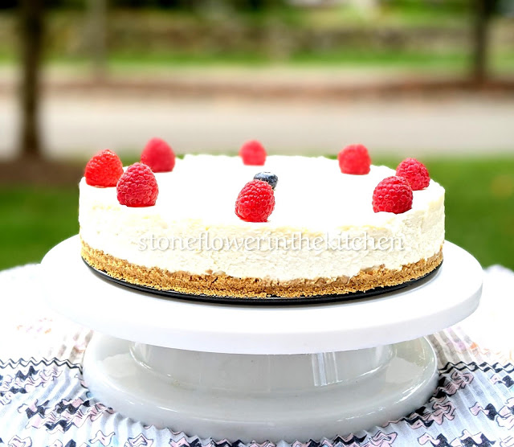

# Cheesecake

## Cheesecake is a simple cake, mostly consisting of cheese, with a graham cracker crust. Yummy! This cake is light and airy. It is a perfect treat, a snack, or cake for anything!!

### Some of its perks include:
* No bake! 
* No cake, just cheese and graham crust
* Quick make time!

